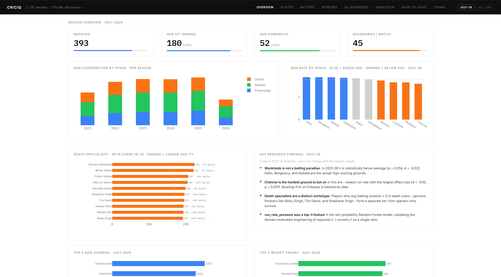
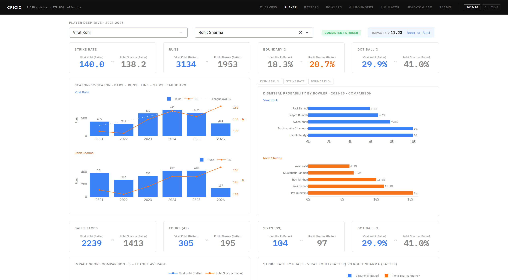

# CricIQ - IPL Tactical Analytics Dashboard

A full-stack cricket analytics project built on ball-by-ball IPL data. The goal is to answer questions that coaching staff and analysts actually care about - not just career averages, but phase-specific performance, bowler matchups, venue effects, win probability, and a composite player impact metric built from first principles.

Built with Python, Pandas, Scikit-learn, and Plotly Dash. Analysis spans 1,175 IPL matches and 279,586 deliveries from 2008 to 2026.

**Live demo**: [criciq-983h.onrender.com](https://criciq-983h.onrender.com)

---

## Dashboard

Eight pages, each answering a distinct analytical question.

| Page | Question it answers |
|------|---------------------|
| **Overview** | How does scoring and performance break down across seasons and phases? |
| **Player Deep-Dive** | What does a player's full profile look like - batting, bowling, impact, matchups? |
| **Batting Analytics** | Who are the best batters in each phase of the innings? |
| **Bowler Analytics** | Who are the most economical death bowlers and powerplay wicket-takers? |
| **Allrounders** | Who genuinely contributes in both departments, and who is one-dimensional? |
| **Match Simulator** | Given a chase state, what is the win probability and how do scenarios change it? |
| **Head-to-Head** | How do two franchises compare across all their meetings? |
| **Team Strategy** | What are a franchise's tactical tendencies - by phase, by venue, by season? |

All pages respond to a season filter (default: 2021-26). This keeps the analysis relevant to modern T20 cricket, which is structurally different from the 2008-2015 era in batting aggression and death-over tactics.

---

## Screenshots

**Overview - season trends, venue intelligence, phase breakdown**


**Player Deep-Dive - Virat Kohli vs Rohit Sharma comparison**


---

## Key Findings

These came out of the analysis and are surfaced in the dashboard - I wrote the hypotheses before running any numbers.

**Venue**
- Wankhede is not a batting paradise. In 2021-26 it is statistically below the league average (p = 0.014, Cohen's d = -0.02). Delhi, Bengaluru, and Kolkata are the actual high-scoring grounds.
- Chennai (Chepauk) is the hardest venue to bat at in this era - lowest run rate with the largest negative effect size (d = -0.10, p < 0.001). Bowling-first at Chepauk is backed by data.

**Batting**
- Death specialists are a distinct archetype from openers who survive to the death. Filtering by average batting position > 5 correctly separates genuine finishers (Rinku Singh, Tim David, Shashank Singh) from well-settled openers.
- Complete batsmen are rare. Only a small number of players qualify with 50+ balls faced in both the powerplay and death phases.

**Win Probability Model**
- The engineered feature `run_rate_pressure` (= required run rate / current run rate) ranked as a top-3 feature importance in the Random Forest model, validating the domain-motivated approach over using raw rates independently.

**Allrounders**
- The allrounder pool applies a bowling regularity filter (`bowl_per_match >= 6` career average) on top of the 50-ball volume threshold. Without it, players who bowled 50 balls across 8 lucky matches displace genuine allrounders like Jadeja and Axar Patel. Of players who pass this stricter bar, only a subset sit in the elite quadrant (positive z-score in both batting and bowling) - genuine two-department contributors are rarer than commentators suggest.

---

## Analysis Angles

The analysis is structured around five distinct angles, each in its own Jupyter notebook.

**1. Phase-wise Batting** (`notebooks/02_phase_batting.ipynb`)
Metrics per batsman per phase (powerplay / middle / death): strike rate, boundary %, dot ball %. Minimum 50 balls faced in each specific phase to qualify - thresholds are independent. Death specialist classification requires avg batting position > 5 to distinguish genuine finishers from openers.

**2. Bowler Matchup Analysis** (`notebooks/03_bowler_matchups.ipynb`)
798 bowler-batsman matchups at 20+ balls faced. Heatmaps for strike rate and dismissal probability. K-means clustering (k=4) on batsman vulnerability profiles across bowler types - produces archetypes like spin-vulnerable and pace-vulnerable. 36 batsmen eligible for clustering.

**3. Venue and Pitch Impact** (`notebooks/04_venue_impact.ipynb`)
Independent-sample t-tests comparing each venue's run rate against all others. Reports both p-value and Cohen's d - statistical significance alone does not tell you whether the difference is practically meaningful. 10 qualified venues (3+ seasons of data, not COVID-era UAE or 2022-only overflow grounds).

**4. Win Probability Model** (`notebooks/05_win_probability.ipynb`)
Logistic Regression baseline trained on 2019-2026 chase data. Features include current run rate, required run rate, run_rate_pressure (engineered), wickets in hand, overs remaining, venue, and batting team. Evaluated with accuracy, ROC-AUC, and a calibration curve - the calibration curve validates that predicted probabilities are actually reliable, not just that the classifier is accurate.

**5. Player Impact Score** (`notebooks/06_player_impact.ipynb`)
Composite metric: batting contribution vs phase average (50%), bowling economy vs venue average (35%), fielding from wicket records (15%). Weights are per-role - a pure batsman is not penalised for not bowling. Produces per-match scores and season leaderboards from 2021-26.

**6. Allrounder Stats** (`notebooks/07_allrounder_stats.ipynb`)
Within-pool z-scores for batting SR and bowling economy. The pool requires 50+ balls faced AND 50+ balls bowled in the same season, then applies a `bowl_per_match >= 6` career filter to remove players who hit the volume threshold via a small number of lucky appearances. Z-scores are re-computed within this stricter pool. The dashboard callback adds a per-window consistency filter (2+ seasons for 2021-26, 3+ for all-time) and re-normalizes z-scores at render time. Saves `allrounder_scores.csv` and `allrounder_season_best.csv` covering all seasons 2008-2026.

**7. Batter Season Stats** (`notebooks/08_batter_season_stats.ipynb`)
Per-batter per-season stats for all three phases: balls, runs, SR, boundary%, dot%. Saves `batter_phase_season.csv` - one row per batter per season with all phase columns. The dashboard aggregates across seasons client-side so any season window works correctly.

**8. Bowler Season Stats** (`notebooks/09_bowler_season_stats.ipynb`)
Per-bowler per-season phase stats: balls, runs, wickets, economy for powerplay, death, and overall. Also saves `bowler_wicket_types.csv` with three dismissal categories (bowled+lbw, caught, other).

**9. Team Season Stats** (`notebooks/10_team_season_stats.ipynb`)
Per-team per-season: phase scoring averages, win/loss record, toss decisions, and batting depth (avg runs from positions 7-9 per match). Saves `team_season_stats.csv`.

---

## Tech Stack

- **Language**: Python 3.11
- **Data processing**: Pandas, NumPy
- **ML / stats**: Scikit-learn (Logistic Regression, Random Forest, K-means), Scipy (t-tests, Cohen's d)
- **Visualization**: Plotly (all charts in the dashboard)
- **Dashboard**: Dash with Dash Bootstrap Components for layout
- **Notebooks**: Jupyter for EDA and analysis

---

## How I Built This

A few decisions that shaped the project and that I think are worth explaining.

**Pre-flattening all data into two canonical DataFrames**

Cricsheet delivers data as nested JSON - one file per match, with deliveries nested inside innings inside each file. I parse all of it once upfront into `deliveries.csv` (one row per ball) and `matches.csv` (one row per match). Every notebook and every dashboard page reads from those two files. The alternative - re-parsing JSON on each query - would have made every analysis slower and harder to reproduce. Separating data engineering from analysis also means I could validate the parser once and trust it everywhere downstream.

**Notebook-first data architecture**

All data shown in the dashboard is pre-computed in a Jupyter notebook and saved to a CSV. Dashboard callbacks only filter and render - no groupby, no aggregation inside a callback. Pre-computed CSVs store one row per entity per season so any season window (2021-26, all-time, or custom) works correctly by filtering on the `season` column at callback time. Pages that are inherently user-selection-driven (`player.py`, `head_to_head.py`, `simulator.py`) stay DEL-based since the stat space is too large to pre-compute.

**Engineering `run_rate_pressure` as a feature**

For the win probability model I could have just used current run rate and required run rate as separate features. Instead I engineered their ratio: `required_run_rate / current_run_rate`. The reasoning is that analysts don't think in raw rates independently - they think about whether the required rate is ahead or behind the scoring rate. A ratio captures that relationship directly. This feature ranked in the top 3 by importance in the Random Forest model, which validated the domain-motivated approach.

**Retraining the win probability model at startup**

The saved `.pkl` files became unusable after a scikit-learn version upgrade - the serialised model format changed between versions. Rather than pin the version or maintain two model files, `pages/simulator.py` retrains a fresh Logistic Regression at server startup using the processed data. It takes about 2 seconds and means the model is always trained on the exact sklearn version that's installed.

**The 2021-2026 default window**

T20 cricket in 2008-2015 was structurally different - lower average scores, different death-over tactics, no impact player rule, fewer overseas specialists. Using all-time data would produce leaderboards dominated by retired players from a different era of the game. The default filter to 2021-2026 keeps the analysis relevant to how IPL is actually played today. An all-time toggle is available for historical comparisons.

**Death specialist classification by batting position**

A naive death-overs leaderboard includes openers who simply survived to the death. A Virat Kohli facing 40 balls in overs 16-20 because he came in at the fall of the first wicket is not a death specialist - he is a top-order anchor playing out the innings. I filter death leaderboards to batsmen with average batting position > 5, which correctly surfaces genuine finishers like Rinku Singh and Tim David while excluding settled openers.

**Data-driven player page sections**

Rather than maintain a role classification table (batsman / bowler / allrounder), the player page decides what to render based on what the data shows. The batting section appears if the player has 50+ balls faced in any single phase. The bowling section appears if they have 50+ balls bowled total. This means the page is always accurate - it shows what a player actually contributed, not what their listed role says they should contribute.

---

## Data

**Primary source**: [Cricsheet](https://cricsheet.org) - ball-by-ball IPL data in JSON format, every match since 2008. Flattened into two canonical DataFrames at the start of the pipeline:

- `deliveries.csv` - 279,586 rows, one per delivery. Columns include phase, batting position, cumulative run rate, required run rate, run_rate_pressure, super_over flag, and all wicket metadata.
- `matches.csv` - 1,175 rows, one per match. Columns include toss decision, result margin, and player of the match.

**Secondary source**: Kaggle IPL Player Performance Dataset - career aggregates and auction prices.

Player name normalisation is handled by `src/name_map.py` since Cricsheet uses different spellings across seasons.

---

## Running the App

```bash
# Clone the repo
git clone https://github.com/skanda-2003/criciq.git
cd criciq

# Install dependencies
pip install -r requirements.txt

# Run the Dash app
python app.py
```

The app starts on `http://localhost:8050`. On first run, the win probability model trains and saves to `models/wp_model.pkl` (~2 seconds). All subsequent starts load from that file instantly.

To regenerate the processed CSVs from raw Cricsheet data:
```bash
python main.py
```

To run the analysis notebooks:
```bash
jupyter notebook notebooks/
```

---

## Project Structure

```
criciq/
├── app.py              # Dash entry point
├── pages/              # One file per page (8 pages total)
├── components/         # Reusable UI - metric_card, navbar, charts, theme
├── assets/style.css    # All styling (no inline styles except dynamic progress bars)
├── data/
│   ├── loader.py       # Shared DataFrame loader
│   ├── raw/            # Cricsheet JSONs and Kaggle CSVs
│   └── processed/      # deliveries.csv, matches.csv, and pre-computed analysis CSVs
├── notebooks/          # 10 notebooks: parser validation, 5 analysis angles, 4 pre-compute notebooks
├── src/                # parser.py, name_map.py, wp_model.py
└── models/             # Saved encoder artifacts
```

---

## Known Limitations

These are worth knowing if you're extending the project or evaluating the analysis.

- **Fielding is incomplete**: Cricsheet only records catches and run-outs from wicket metadata. Direct throws, misfields, and fielding stops are not captured. The fielding component of the impact score is an undercount.
- **Win probability is 2nd innings only**: The current model only applies to chases. A 1st innings win probability model would need a different feature set and architecture.
- **Venue conditions change**: Pitch preparation at the same ground can shift across seasons. Restricting to 2021-26 reduces (but does not eliminate) this noise.
- **Name normalisation is incomplete**: `src/name_map.py` covers 202 known players but may miss edge cases for players with inconsistent Cricsheet spellings across seasons.
- **Auction price comparison is indicative**: Auction prices reflect expected future value, not just past performance. The "outperforming reputation" angle is interesting but not rigorous.
